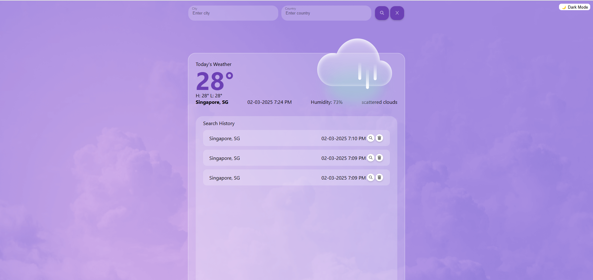

# Simple Weather Forecast

## Features
1. You can input city and country name to get weather information
2. If invalid city or country name is inputted, show appropriate message on UI.
3. You can find your search records in search history. 
4. Theme switcher is available and you may choose to see in light or dark mode

## Available Scripts

In the project directory, you can run:

### `npm start`

Runs the app in the development mode.\
Open [http://localhost:3000](http://localhost:3000) to view it in your browser.

The page will reload when you make changes.\
You may also see any lint errors in the console.